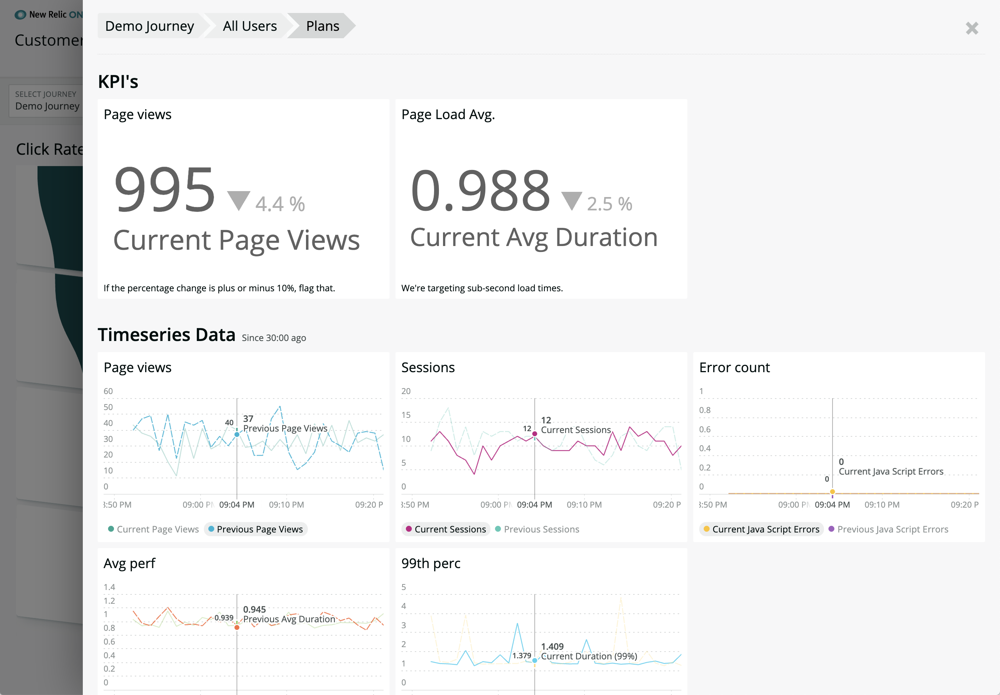

[](https://opensource.newrelic.com/oss-category/#community-project)

# New Relic One Customer Journey (nr1-customer-journey)
[](#contributors)

  [](https://snyk.io/test/github/newrelic/nr1-customer-journey)


## Overview

`nr1-customer-journey` is like a [NRQL funnel query](https://docs.newrelic.com/docs/query-data/nrql-new-relic-query-language/nrql-query-examples/funnels-evaluate-data-series-events) on steroids. The Nerdpack is designed to allow devops teams, product manager, and digital marketers to examine a number of pre-defined measures in a side-by-side comparison between cohorts (columns) of users through a set of steps (rows).

* Rows = Steps
* Columns = Series
* Measures = Stats

The application does this through a few visualizations.

### Multi-series Funnel

It leverages a [`nr1-funnel-component`](https://github.com/newrelic/nr1-funnel-component). This visualization combines a 3rd party funnel library with the NR1 `NerdGraphQuery` component to execute three New Relic `NRQL` queries in the same GraphQL request and align the results into one data set that is delivered to the funnel visualization.

### Data panels

For each row (Step) and column (Series), the Nerdpack renders a set of measurements (Stat). Those calculations can apply KPI thresholds to color-code the information. Each panel is also `clickable`, leading to a more detailed overview.


### Detail Nerdlet

For any `Journey`, `Series`, and `Step`, there's a Nerdlet that will display the more detailed KPI's as well as timeseries view of the the given `Stats` for the selected row and column.



## Usage

Currently, the application is driven by a relatively complex JSON config file. The documentation for that configuration file is available [here](CONFIG.md).

## Open Source License

This project is distributed under the [Apache 2 license](LICENSE).

## What do you need to make this work?

1. Access to [New Relic One](https://newrelic.com/platform).
2. Configure Journey with built-in form.

### Configuring new Journey

In `nr1-customer-journey` you can use wizard form to configure Journeys which will be saved in `AccountStorage`. See [CONFIG.md](CONFIG.md) for detailed instructions on the capabilities of each portion of the configuration. Also look at the [examples](examples) directory for inspiration.

## Getting started

First, ensure that you have [Git](https://git-scm.com/book/en/v2/Getting-Started-Installing-Git) and [NPM](https://www.npmjs.com/get-npm) installed. If you're unsure whether you have one or both of them installed, run the following command(s) (If you have them installed these commands will return a version number, if not, the commands won't be recognized):

```bash
git --version
npm -v
```

Next, install the [NR1 CLI](https://one.newrelic.com/launcher/developer-center.launcher) by going to [this link](https://one.newrelic.com/launcher/developer-center.launcher) and following the instructions (5 minutes or less) to install and setup your New Relic development environment.

Next, to clone this repository and run the code locally against your New Relic data, execute the following command:

```bash
nr1 nerdpack:clone -r https://github.com/newrelic/nr1-customer-journey.git
cd nr1-customer-journey
nr1 nerdpack:serve
```

Visit [https://one.newrelic.com/?nerdpacks=local](https://one.newrelic.com/?nerdpacks=local), navigate to the Nerdpack, and :sparkles:

## Deploying this Nerdpack

Open a command prompt in the nerdpack's directory and run the following commands.

```bash
# If you need to create a new uuid for the account to which you're deploying this Nerdpack, use the following
# nr1 nerdpack:uuid -g [--profile=your_profile_name]
# to see a list of APIkeys / profiles available in your development environment, run nr1 credentials:list
nr1 nerdpack:publish [--profile=your_profile_name]
nr1 nerdpack:deploy [-c [DEV|BETA|STABLE]] [--profile=your_profile_name]
nr1 nerdpack:subscribe [-c [DEV|BETA|STABLE]] [--profile=your_profile_name]
```

Visit [https://one.newrelic.com](https://one.newrelic.com), navigate to the Nerdpack, and :sparkles:

## Support

New Relic has open-sourced this project. This project is provided AS-IS WITHOUT WARRANTY OR SUPPORT, although you can report issues and contribute to the project here on GitHub.

_Please do not report issues with this software to New Relic Global Technical Support._

### Community

New Relic hosts and moderates an online forum where customers can interact with New Relic employees as well as other customers to get help and share best practices. Like all official New Relic open source projects, there's a related Community topic in the New Relic Explorers Hub. You can find this project's topic/threads here:

https://discuss.newrelic.com/t/customer-journey-nerdpack/83270
*(Note: URL subject to change before GA)*

### Issues / Enhancement Requests

Issues and enhancement requests can be submitted in the [Issues tab of this repository](../../issues). Please search for and review the existing open issues before submitting a new issue.

## Contributing

Contributions are welcome (and if you submit a Enhancement Request, expect to be invited to contribute it yourself :grin:). Please review our [Contributors Guide](CONTRIBUTING.md).

Keep in mind that when you submit your pull request, you'll need to sign the CLA via the click-through using CLA-Assistant. If you'd like to execute our corporate CLA, or if you have any questions, please drop us an email at opensource@newrelic.com.

## Contributors ✨

Thanks goes to these wonderful people ([emoji key](https://allcontributors.org/docs/en/emoji-key)):

<!-- ALL-CONTRIBUTORS-LIST:START - Do not remove or modify this section -->
<!-- prettier-ignore -->
<table>
  <tr>
    <td align="center"><a href="http://joelworrall.com"><br /><sub><b>Joel Worrall</b></sub></a><br /><a href="https://github.com/newrelic/nr1-customer-journey/commits?author=tangollama" title="Code">💻</a> <a href="#ideas-tangollama" title="Ideas, Planning, & Feedback">🤔</a></td>
    <td align="center"><a href="https://twitter.com/dangolden1"><br /><sub><b>Daniel Golden</b></sub></a><br /><a href="#ideas-danielgolden" title="Ideas, Planning, & Feedback">🤔</a> <a href="https://github.com/newrelic/nr1-customer-journey/commits?author=danielgolden" title="Code">💻</a> <a href="#design-danielgolden" title="Design">🎨</a></td>
    <td align="center"><a href="https://github.com/wesleyradcliffe"><br /><sub><b>Wesley D. Radcliffe</b></sub></a><br /><a href="#ideas-wesleyradcliffe" title="Ideas, Planning, & Feedback">🤔</a> <a href="https://github.com/newrelic/nr1-customer-journey/commits?author=wesleyradcliffe" title="Code">💻</a></td>
    <td align="center"><a href="http://devfreddy.com"><br /><sub><b>Michael Frederick</b></sub></a><br /><a href="#tool-devfreddy" title="Tools">🔧</a> <a href="https://github.com/newrelic/nr1-customer-journey/commits?author=devfreddy" title="Code">💻</a></td>
  </tr>
</table>

<!-- ALL-CONTRIBUTORS-LIST:END -->

This project follows the [all-contributors](https://github.com/all-contributors/all-contributors) specification. Contributions of any kind welcome!
